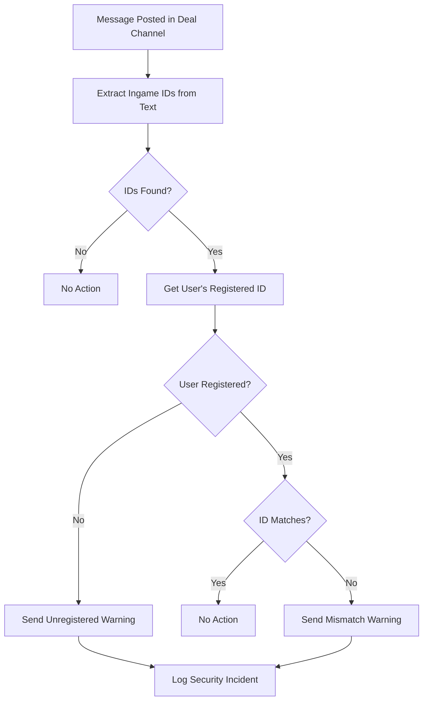

# 🛡️ Ingame ID Security System Documentation

## Overview

The **Ingame ID Security System** is a comprehensive anti-fraud protection system that prevents identity theft, account spoofing, and multi-accounting in your Discord marketplace bot. It links Discord accounts to ingame identities and provides real-time monitoring of deal channels.

## 🌟 Key Features

### ✅ **Ingame ID Registration**
- **Mandatory Collection**: Users must provide their ingame ID when accepting rules
- **Format Validation**: Strict format validation (2 letters + 6 numbers, e.g., `RC463713`)
- **Duplicate Prevention**: Each ingame ID can only be registered once
- **Automatic Role Assignment**: Users receive the Member role after successful registration

### 🔍 **Real-time Fraud Detection**
- **Message Monitoring**: Scans all deal channels for ingame ID mentions
- **Mismatch Detection**: Alerts when users share different IDs than registered
- **Unregistered User Detection**: Warns when unregistered users attempt to trade
- **Automatic Warnings**: Sends security alerts to deal channels

### 👨‍💼 **Admin Management Tools**
- **`/changeid`**: Change any user's ingame ID
- **`/viewid`**: View a user's registered ingame ID
- **`/listids`**: List all registered ingame IDs
- **`/deleteid`**: Remove a user's ingame ID registration

### 📋 **Enhanced Rules System**
- **Integrated Modal**: Collects ingame ID during rule acceptance
- **User-Friendly Errors**: Detailed error messages sent via DM
- **Backward Compatibility**: Fallback behavior if security system unavailable

## 🚀 How It Works

### 1. **User Registration Flow**

```mermaid
graph TD
    A[User clicks "Accept Rules"] --> B[Security Modal Opens]
    B --> C[User enters Ingame ID]
    C --> D{Format Valid?}
    D -->|No| E[Send Format Error DM]
    D -->|Yes| F{ID Already Exists?}
    F -->|Yes| G[Send Duplicate Error DM]
    F -->|No| H{User Already Registered?}
    H -->|Yes| I[Send Already Registered DM]
    H -->|No| J[Save to Database]
    J --> K[Assign Member Role]
    K --> L[Welcome Message]
    E --> M[Registration Failed]
    G --> M
    I --> M
```

### 2. **Real-time Monitoring**



## 📊 Database Schema

### **user_ingame_ids Table**
```sql
CREATE TABLE user_ingame_ids (
    discord_id BIGINT PRIMARY KEY,           -- Discord user ID
    ingame_id VARCHAR(10) UNIQUE NOT NULL,   -- Ingame ID (e.g., RC463713)
    created_at TIMESTAMP DEFAULT CURRENT_TIMESTAMP,
    updated_at TIMESTAMP DEFAULT CURRENT_TIMESTAMP ON UPDATE CURRENT_TIMESTAMP
);
```

## 🔧 Admin Commands

### `/changeid @user new_id`
**Purpose**: Change a user's ingame ID  
**Permissions**: Administrator only  
**Example**: `/changeid @Tico RC463713`

**Features**:
- Validates new ID format
- Prevents duplicate IDs
- Logs all changes
- Notifies user via DM
- Supports both updating existing IDs and adding new ones

### `/viewid @user`
**Purpose**: View a user's registered ingame ID  
**Permissions**: Administrator only  
**Example**: `/viewid @Tico`

**Output**:
- User's Discord information
- Registered ingame ID (or "Not registered")
- Registration status

### `/listids`
**Purpose**: List all registered ingame IDs  
**Permissions**: Administrator only  
**Example**: `/listids`

**Features**:
- Shows up to 20 entries per page
- Displays user names and registration dates
- Sorted by most recent registrations

### `/deleteid @user`
**Purpose**: Remove a user's ingame ID registration  
**Permissions**: Administrator only  
**Example**: `/deleteid @Tico`

**Effects**:
- Removes ID from database
- User will need to re-register
- Logs the deletion
- Notifies user via DM

## ⚠️ Security Alerts

### **ID Mismatch Warning**
```
🚨 SECURITY ALERT: Ingame ID Mismatch Detected

@User is using a different ingame ID than registered!

Registered ID: RC463713
Used in message: AB123456

⚠️ WARNING SIGNS OF POTENTIAL SCAM:
• User is sharing different ingame ID
• This could be identity theft
• DO NOT PROCEED WITH THIS DEAL

@User - If this is a mistake, use your registered ID: RC463713
```

### **Unregistered User Warning**
```
⚠️ Unregistered User Sharing Ingame ID

@User appears to be sharing an ingame ID but is not registered in our security system.

Security Notice:
• This user bypassed the normal registration process
• Their identity cannot be verified
• Proceed with extreme caution

Recommendation: Ask them to complete registration through the rules channel first.
```

## 🔐 Security Benefits

### **Prevents Identity Theft**
- Links Discord accounts to specific ingame IDs
- Detects when users attempt to use someone else's ID
- Real-time alerts prevent successful fraud attempts

### **Eliminates Multi-Accounting**
- One ingame ID per Discord account limit
- Prevents users from creating multiple Discord accounts
- Database constraints ensure uniqueness

### **Provides Audit Trail**
- All ID changes logged with admin information
- Complete history of registrations and modifications
- Security incidents automatically logged

### **Real-time Protection**
- Monitors all deal channels continuously
- Immediate warnings when suspicious activity detected
- No manual oversight required

## 🛠️ Technical Implementation

### **Format Validation**
```python
# Ingame ID must match: 2 letters + 6 numbers
PATTERN = r'^[A-Z]{2}\d{6}$'

# Valid examples:
RC463713  ✅
AB123456  ✅
XY789012  ✅

# Invalid examples:
R463713   ❌ (only 1 letter)
RC46371   ❌ (only 5 numbers)
1C463713  ❌ (number first)
RC46371A  ❌ (letter in numbers)
```

### **Text Extraction**
```python
# Extracts valid ingame IDs from any text
text = "My ID is RC463713 and friend has AB123456"
extracted = extract_ingame_ids_from_text(text)
# Result: ['RC463713', 'AB123456']
```

### **Database Integration**
```python
# Add new ingame ID
success = add_user_ingame_id(discord_id, "RC463713")

# Get user's ID
ingame_id = get_user_ingame_id(discord_id)

# Check if ID exists
exists = ingame_id_exists("RC463713")

# Update existing ID
success = update_user_ingame_id(discord_id, "AB123456")
```

## 📈 Configuration

### **Environment Variables**
All configuration is handled through the existing `config.py` system:

```python
# Member role ID (assigned after registration)
MEMBER_ROLE_ID = 1394786020842799235

# Database configuration (existing)
MYSQL_HOST = "localhost"
MYSQL_USER = "root"
MYSQL_PASSWORD = "your_password"
MYSQL_DATABASE = "bot_database"
```

### **Channel Monitoring**
The system automatically monitors these channel types:
- `car-sale-*` - Sale negotiations
- `car-trade-*` - Trade negotiations  
- `auction-deal-*` - Auction completions
- `giveaway-claim-*` - Giveaway claims
- `admin-giveaway-claim-*` - Admin giveaway management

## 🧪 Testing

### **Test Suite**
Run the comprehensive test suite:
```bash
python3 test_security_system.py
```

### **Core Function Testing**
Test individual components:
```bash
python3 -c "from database_mysql import validate_ingame_id_format; print(validate_ingame_id_format('RC463713'))"
```

### **Mock Environment**
The system includes mock Discord classes for testing without dependencies:
```python
from test_mock_discord import setup_mock_discord
setup_mock_discord()
```

## 🔄 Migration Guide

### **Existing Users**
- Existing users will need to register their ingame ID
- They can do this by clicking "Accept Rules" again
- No disruption to existing functionality

### **Database Migration**
The system automatically creates the required table:
```sql
-- This table is created automatically on startup
CREATE TABLE IF NOT EXISTS user_ingame_ids (
    discord_id BIGINT PRIMARY KEY,
    ingame_id VARCHAR(10) UNIQUE NOT NULL,
    created_at TIMESTAMP DEFAULT CURRENT_TIMESTAMP,
    updated_at TIMESTAMP DEFAULT CURRENT_TIMESTAMP ON UPDATE CURRENT_TIMESTAMP
);
```

## 🚨 Troubleshooting

### **Common Issues**

**1. Modal doesn't appear when clicking "Accept Rules"**
- Check that `security_system.py` is imported correctly
- Verify Discord permissions for the bot
- Check console logs for import errors

**2. Database errors during registration**
- Ensure MySQL is running and accessible
- Verify database credentials in environment variables
- Check that the `user_ingame_ids` table was created

**3. Security monitoring not working**
- Verify `SECURITY_SYSTEM_AVAILABLE` is `True` in logs
- Check that the security monitor is initialized
- Ensure deal channels follow the correct naming pattern

**4. Admin commands not appearing**
- Verify admin has the correct permissions
- Check that commands were synced successfully
- Ensure bot has the necessary Discord permissions

### **Debug Mode**
Enable detailed logging by checking the console output:
```
Security monitoring system initialized  ✅
Admin security commands setup complete  ✅
```

## 📞 Support

If you encounter any issues with the security system:

1. **Check the logs** for error messages
2. **Run the test suite** to verify functionality
3. **Review the troubleshooting section** above
4. **Contact support** in the #support channel

## 🎯 Summary

The Ingame ID Security System provides **enterprise-level anti-fraud protection** while maintaining a **user-friendly experience**. It prevents identity theft, eliminates multi-accounting, and provides real-time monitoring of all trading activities.

**Key Benefits**:
- 🛡️ **Complete fraud prevention**
- ⚡ **Real-time monitoring**
- 👨‍💼 **Powerful admin tools**
- 🔧 **Easy to manage**
- 📊 **Comprehensive logging**
- 🔄 **Backward compatible**

Your Discord marketplace is now protected by a state-of-the-art security system! 🚀